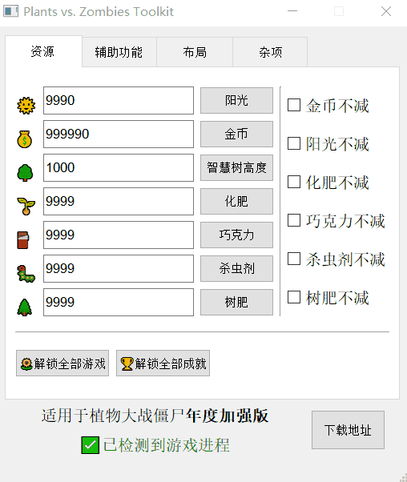

# 一款用Python写的植物大战僵尸修改器

本项目仅用于学习和娱乐，一些代码与可视化界面布局参考了著名的植物大战僵尸修改器项目[PvZToolKit](https://github.com/lmintlcx/pvztoolkit)

内存地址通过Cheat Engine获取以及参考[MemoryAddressList](https://github.com/Lazuplis-Mei/pvzclass/blob/master/MemoryAddressList)

由于本项目的娱乐、学习性质，本项目只适用于《植物大战僵尸年度加强版》这一种版本，但其中涉及到的方法和逻辑是相通的，在任何版本的游戏中均可实现，不过我无暇顾及各种版本，因此只写了一种。

# 界面展示

